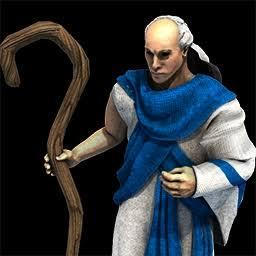
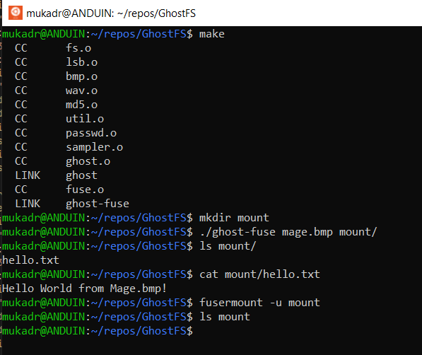

ghostfs
=======

Steganographic filesystem for FUSE. Supports non compressed WAVE and BMP files.




## Build instructions
#### Install FUSE
###### Linux (Ubuntu)
```
sudo apt-get install libfuse-dev
```
###### Mac OS X
Install MacFUSE: https://osxfuse.github.io/
#### Clone and build
```
git clone http://github.com/mukadr/ghostfs.git
cd ghostfs
make
```
## Usage
#### Format
```
ghost audio.wav f
```
#### Mount
```
ghost-fuse audio.wav folder
```
#### Unmount
###### Linux
```
fusermount -u folder
```
###### Mac OS X
```
umount folder
```
